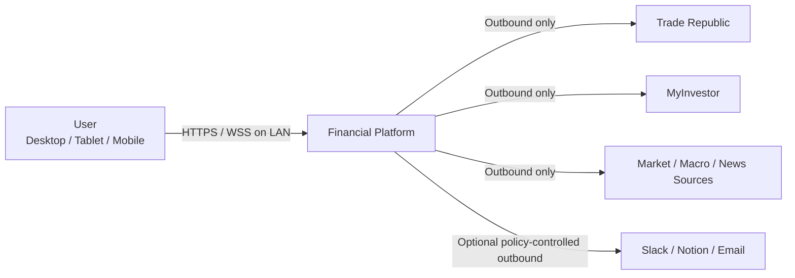
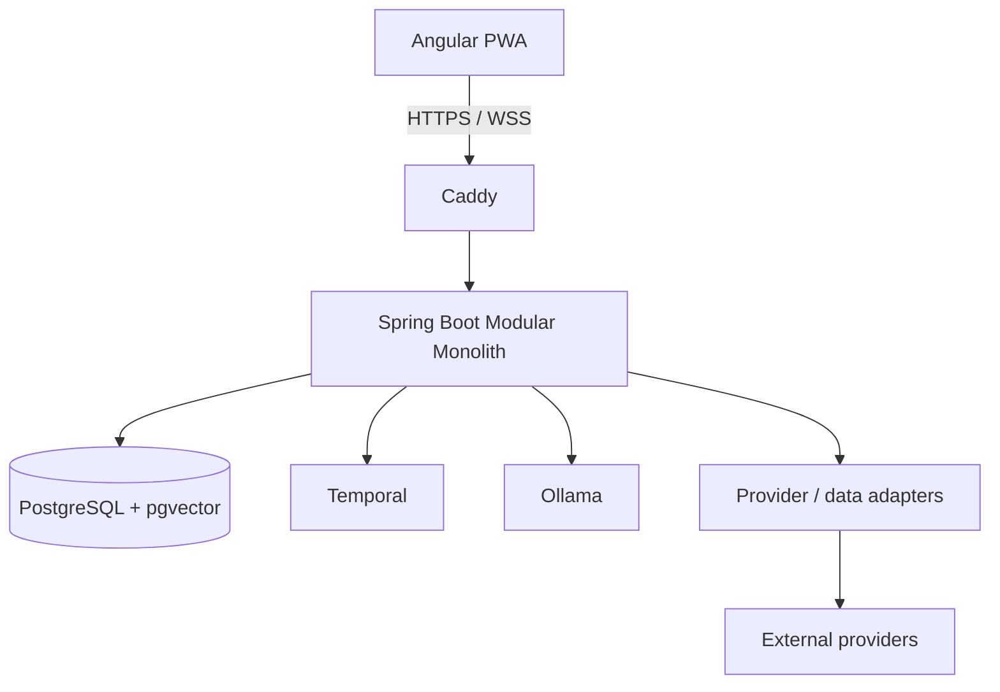

# Architecture Baseline v1.0

## Architectural style

The product is a **modular monolith**. Bounded contexts are independently modeled and verified, but deployed as one Spring Boot application. The design optimizes correctness, replaceability and local operational simplicity over distributed-system novelty.

## Primary bounded contexts

- `identity`
- `workspace`
- `connectivity`
- `instrument`
- `portfolio`
- `portfolio-xray`
- `market`
- `macro`
- `research`
- `analytics`
- `risk`
- `workflow`
- `ai-orchestration`
- `knowledge`
- `reporting`
- `notification`
- `audit`

## Module rules

- Domain code cannot import Spring, persistence, WebSocket, Temporal, MCP or external provider SDK types.
- No JPA entity relationship crosses a bounded-context boundary.
- Cross-context references use typed IDs and application APIs/events.
- Infrastructure adapters implement application/domain ports.
- Spring Modulith/ArchUnit tests enforce dependency boundaries.

## C4 — System Context

## C4 — Containers

Only Caddy is intentionally reachable from other LAN devices. PostgreSQL, backend service ports, Temporal and Ollama remain private to the host/internal container network.

## Backend execution model

Use Spring MVC + WebSocket/STOMP and Java virtual threads for blocking I/O. Reactive types are not allowed to leak into the financial domain merely because an infrastructure library is reactive.

## Initial persistence approach

One PostgreSQL server; separate schemas per bounded context where useful. No cross-context foreign-key relationships. Liquibase owns schema evolution.

## Runtime exclusions

Initial platform deliberately excludes Kubernetes, Kafka, RabbitMQ and Redis. Introduce them only through a future ADR with a demonstrated need.
