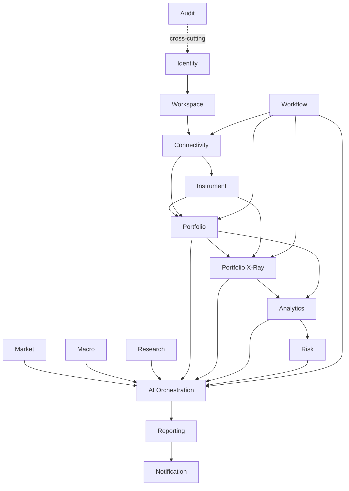

# Module Boundaries

## Allowed dependency direction

Identity and Workspace provide actor/tenancy context. Connectivity supplies normalized external data through application contracts. Portfolio and Instrument form the core financial state. Portfolio X-Ray consumes canonical portfolio/instrument/composition data. Analytics/Risk consume canonical facts and X-Ray outputs. Workflow orchestrates application use cases. AI orchestrates approved tools/use cases and never bypasses application boundaries.

## Forbidden coupling examples

- `portfolio` importing `TradeRepublicClient`.
- `xray` querying MyInvestor directly.
- `ai-orchestration` receiving database entities.
- `workflow` exposing Temporal SDK types to feature modules.
- `frontend` depending on provider-specific DTOs.
- one bounded context using another bounded context's JPA repository/entity.
